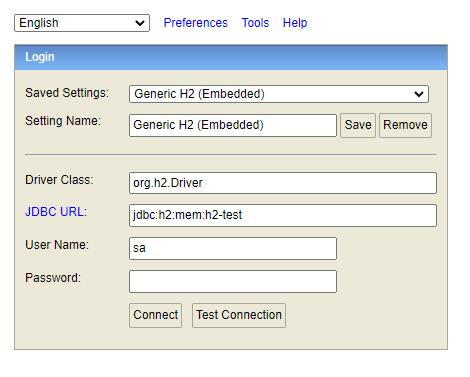
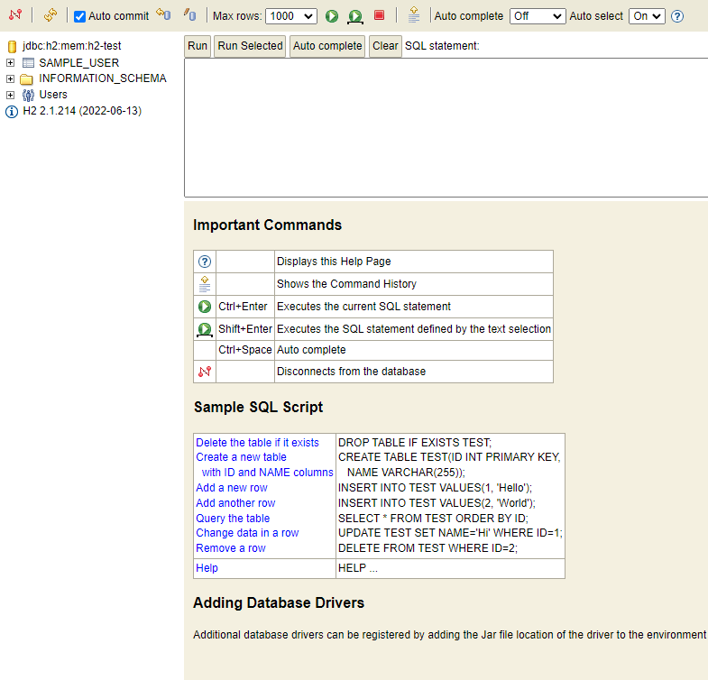

# Spring Boot H2 Database Usage

H2 database는 간단한 프로젝트 작성 및 샘플 데이터를 포함한 프로젝트를 제공하고자 할 때
유용한 라이브러리 입니다. <br/> 이에 대한 간단한 Sample Project 입니다.

# 1. build.gradle 설정

## h2 database import
``` 
...
// https://mvnrepository.com/artifact/com.h2database/h2
implementation group: 'com.h2database', name: 'h2', version: '2.1.214' 
...
```

# 2. application.yml 설정
## hikari CP 사용 시 예시, 다른 Datasource 사용 시 변경점이 있을 수 있음.
```
spring:
  application:
    name: h2-database-sample
  datasource:
      hikari:
        jdbc-url: jdbc:h2:mem:h2-test;TRACE_LEVEL_FILE=4;MODE=MySQL
        driver-class-name: org.h2.Driver
        username: sa
        password:
        maximum-pool-size: 10
  h2:
    console: # H2 Console 사용 및 경로 설정
      enable: true
      path: /h2-console
```
## DB URL 관련 옵션
- 메모리 상에 데이터베이스를 올리겠다. <br/>
  ``` jdbc:h2:mem:h2-test; ```

- 파일로 DB를 관리하면 지정된 경로에 DB 파일을 생성 또는 가져와 구동 <br/>
  ``` jdbc:h2:file:~/Develop/Github/SpringBlogExam/test_db; ```

- 로그 추적 가능하게 트레이스 레벨 설정 <br/>
  ``` jdbc:h2:mem:h2-test;TRACE_LEVEL_FILE=4; ```

- 데이터베이스 실행 모드를 MYSQL 로 설정, ORACLE 및 POSTGRES 도 가능. <br/>
  ``` jdbc:h2:mem:h2-test;TRACE_LEVEL_FILE=4;MODE=MySQL ```

## h2 Console 사용 시
localhost:8080/h2-console 로 접속하면 아래와 같은 화면이 나오며, 접속이 가능하다.
- localhost:8080/h2-console 접속 시 <br/><br/>
  

- connect 클릭하여 접속 시 <br/><br/>
  


# 3. 데이터 초기화 및 입력

## h2 Database 에서는 resouces 경로 밑에 아래의 파일이 있다면 자동으로 실행 시킨다.
### - schema.sql : 테이블 생성 관련


```
/* 1. 일반 테이블 생성 방법 */
-- CREATE TABLE IF NOT EXISTS sample_user
-- (
--     user_id         VARCHAR(50)     NOT NULL,
--     user_name       VARCHAR(50)     NOT NULL,
--     user_age        INTEGER         NOT NULL,    
--     user_join_date  DATE            NOT NULL,
--     PRIMARY KEY (user_id)
-- );

/* 2. CSV 데이터 가져오면서 테이블 생성 */
CREATE TABLE IF NOT EXISTS sample_user
(
    user_id         VARCHAR(50)     NOT NULL,
    user_name       VARCHAR(50)     NOT NULL,
    user_age        INT(10)         NOT NULL,    
    user_join_date  DATE            NOT NULL,
    PRIMARY KEY (user_id)
) AS SELECT * FROM CSVREAD('classpath:sample_table.csv');

/* 3. CSV 데이터 구조 그대로 테이블 생성 및 데이터 입력 */
-- CREATE TABLE IF NOT EXISTS sample_user AS SELECT * FROM CSVREAD('classpath:sample_table.csv');
```

### - data.sql : 데이터 입력 관련
```
INSERT INTO SAMPLE_USER(USER_ID,USER_NAME,USER_AGE,USER_JOIN_DATE) VALUES ('21','user21',30,'2022-01-01');
INSERT INTO SAMPLE_USER(USER_ID,USER_NAME,USER_AGE,USER_JOIN_DATE) VALUES ('22','user22',14,'2022-03-12');
INSERT INTO SAMPLE_USER(USER_ID,USER_NAME,USER_AGE,USER_JOIN_DATE) VALUES ('23','user23',24,'2022-06-21');
INSERT INTO SAMPLE_USER(USER_ID,USER_NAME,USER_AGE,USER_JOIN_DATE) VALUES ('24','user24',67,'2022-02-13');
INSERT INTO SAMPLE_USER(USER_ID,USER_NAME,USER_AGE,USER_JOIN_DATE) VALUES ('25','user25',56,'2022-07-18');
```
